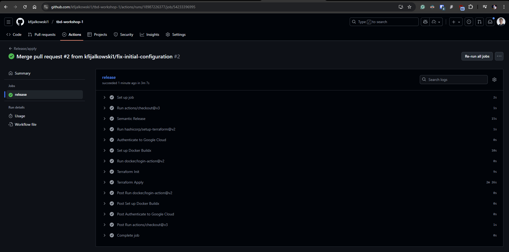

IMPORTANT ❗ ❗ ❗ Please remember to destroy all the resources after each work session. You can recreate infrastructure by creating new PR and merging it to master.
  


1. Authors:

   gr.2

   https://github.com/kfijalkowski1/tbd-workshop-1

   
   
2. Follow all steps in README.md.

3. From avaialble Github Actions select and run destroy on main branch.
   
4. Create new git branch and:
    1. Modify tasks-phase1.md file.
    
    2. Create PR from this branch to **YOUR** master and merge it to make new release. 
    
    

    First release failed due to Github Actions timeout.


5. Analyze terraform code. Play with terraform plan, terraform graph to investigate different modules.

    
    ****

    **Result of terraform graph:**
    ```
    digraph G {
        rankdir = "RL";
        node [shape = rect, fontname = "sans-serif"];
        "google_monitoring_notification_channel.notification_channel" [label="google_monitoring_notification_channel.notification_channel"];
        "google_project.tbd_project" [label="google_project.tbd_project"];
        "google_project_iam_audit_config.tbd_project_audit" [label="google_project_iam_audit_config.tbd_project_audit"];
        "google_project_iam_member.tbd-editor-member" [label="google_project_iam_member.tbd-editor-member"];
        "google_project_iam_member.tbd-editor-supervisors" [label="google_project_iam_member.tbd-editor-supervisors"];
        "google_project_service.tbd-service" [label="google_project_service.tbd-service"];
        "google_service_account.tbd-terraform" [label="google_service_account.tbd-terraform"];
        "google_storage_bucket.tbd-state-bucket" [label="google_storage_bucket.tbd-state-bucket"];
        subgraph "cluster_module.budget" {
            label = "module.budget"
            fontname = "sans-serif"
            "module.budget.data.google_project.project" [label="data.google_project.project"];
            "module.budget.google_billing_budget.budget" [label="google_billing_budget.budget"];
        }
        "google_monitoring_notification_channel.notification_channel" -> "google_project_service.tbd-service";
        "google_project_iam_audit_config.tbd_project_audit" -> "google_project.tbd_project";
        "google_project_iam_member.tbd-editor-member" -> "google_service_account.tbd-terraform";
        "google_project_iam_member.tbd-editor-supervisors" -> "google_project.tbd_project";
        "google_project_service.tbd-service" -> "google_project.tbd_project";
        "google_service_account.tbd-terraform" -> "google_project.tbd_project";
        "google_storage_bucket.tbd-state-bucket" -> "google_project.tbd_project";
        "module.budget.data.google_project.project" -> "google_project_service.tbd-service";
        "module.budget.google_billing_budget.budget" -> "google_monitoring_notification_channel.notification_channel";
        "module.budget.google_billing_budget.budget" -> "module.budget.data.google_project.project";
    }
    ```
    TODO: 

    ***describe one selected module and put the output of terraform graph for this module here***
   
6. Reach YARN UI
   
   ***place the command you used for setting up the tunnel, the port and the screenshot of YARN UI here***
   
7. Draw an architecture diagram (e.g. in draw.io) that includes:
    1. Description of the components of service accounts
    2. List of buckets for disposal
    
    ***place your diagram here***

8. Create a new PR and add costs by entering the expected consumption into Infracost
For all the resources of type: `google_artifact_registry`, `google_storage_bucket`, `google_service_networking_connection`
create a sample usage profiles and add it to the Infracost task in CI/CD pipeline. Usage file [example](https://github.com/infracost/infracost/blob/master/infracost-usage-example.yml) 

   ***place the expected consumption you entered here***

   ***place the screenshot from infracost output here***

9. Create a BigQuery dataset and an external table using SQL
    
    ***place the code and output here***
   
    ***why does ORC not require a table schema?***

10. Find and correct the error in spark-job.py

    ***describe the cause and how to find the error***

11. Add support for preemptible/spot instances in a Dataproc cluster

    ***place the link to the modified file and inserted terraform code***
    
12. Triggered Terraform Destroy on Schedule or After PR Merge. Goal: make sure we never forget to clean up resources and burn money.

Add a new GitHub Actions workflow that:
  1. runs terraform destroy -auto-approve
  2. triggers automatically:
   
   a) on a fixed schedule (e.g. every day at 20:00 UTC)
   
   b) when a PR is merged to main containing [CLEANUP] tag in title

Steps:
  1. Create file .github/workflows/auto-destroy.yml
  2. Configure it to authenticate and destroy Terraform resources
  3. Test the trigger (schedule or cleanup-tagged PR)
     
***paste workflow YAML here***

***paste screenshot/log snippet confirming the auto-destroy ran***

***write one sentence why scheduling cleanup helps in this workshop***
